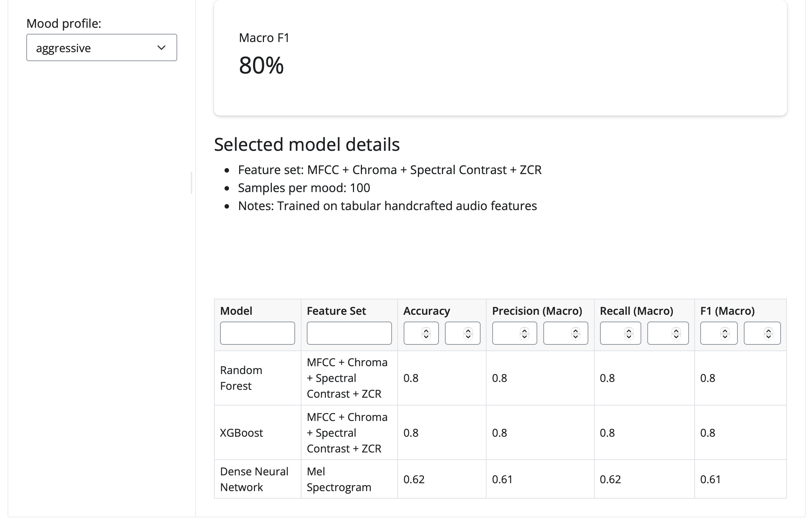

# Projects

A selection of data science projects showcasing different techniques and technologies.

## Music Mood Classification (Shiny + OOP)

An object-oriented Shiny for Python app that presents results from my music mood classification notebook.

The project demonstrates OOP design with domain models, repository/service layers, and chart strategy classes. It uses Shiny for interactivity and Plotly for dynamic visualizations.

[View Project Details →](project1.qmd)
